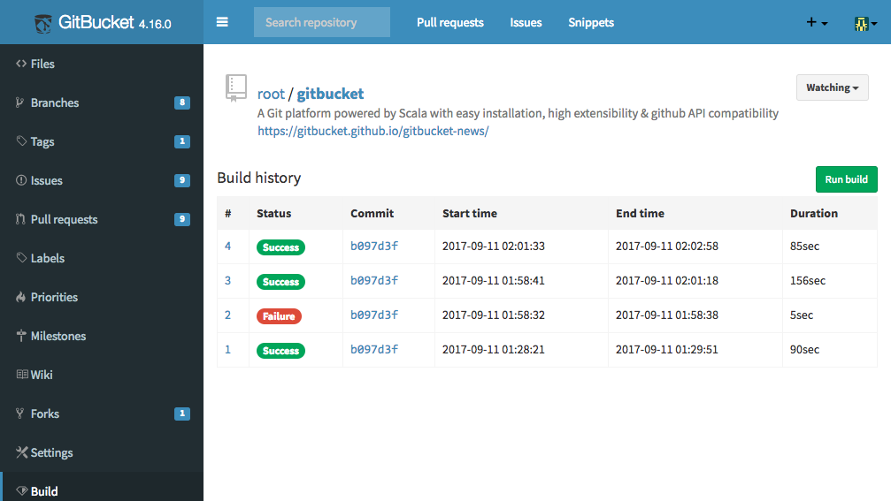
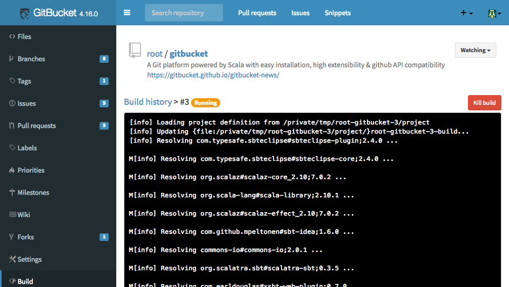

gitbucket-ci-plugin 
========
GitBucket plug-in that adds simple CI ability to GitBucket.

This plug-in allows repository owners to configure build command, and run them at following timing:

- Push commits to the default branch
- Create a new pull request
- Push additional commits to the pull request branch

You can skip a build by including specific words in the commit message. Moreover you can also re-run the pull request build by adding a comment including specific words. These words can be set at the build settings.

In the build script, following environment variables are available:

- `CI` (true)
- `HOME` (root of the build directory)
- `CI_BUILD_DIR` (same as HOME)
- `CI_BUILD_NUMBER`
- `CI_BUILD_BRANCH`
- `CI_COMMIT_ID`
- `CI_COMMIT_MESSAGE`
- `CI_REPO_SLUG` ("owner/repo")
- `CI_PULL_REQUEST` (pull request id or "false")
- `CI_PULL_REQUEST_SLUG` ("owner/repo" or "")

Note that you must not use this plug-in in public environment because it allows executing any commands on a GitBucket instance. It will be **a serious security hole**.

In addition, this plug-in is made to just experiment continuous integration on GitBucket easily without complex settings of webhook or Jenkins. It doesn't have flexibility and scalability, and also has a security issue which is mentioned above. Therefore, if you like it and would like to use for your project actually, we recommend to setup Jenkins or other CI tool and move to it.

## Compatibility

Plugin version | GitBucket version
:--------------|:--------------------
1.4.x -        | 4.23.x -
1.3.x -        | 4.19.x -
1.0.x - 1.2.x  | 4.17.x, 4.18.x

## Installation

Download jar file from [the release page](https://github.com/takezoe/gitbucket-ci-plugin/releases) and put into `GITBUCKET_HOME/plugins`.

## Build

Run `sbt assembly` and copy generated `/target/scala-2.12/gitbucket-ci-plugin-assembply-x.x.x.jar` to `~/.gitbucket/plugins/` (If the directory does not exist, create it by hand before copying the jar), or just run `sbt install`.

## Release Notes

### 1.4.0

- Max parallel builds and max stored history became configurable

### 1.3.0

- update for Scalatra 2.6
- fix skipping pull request build bug

### 1.2.0

- build workspace browser
- altered build directories location

### 1.1.0

- skip build by commit message
- re-run build by pull request comment
- supply environment variables in build script

### 1.0.1

- build status badge
- fix pull request build bug

### 1.0.0

- First release
